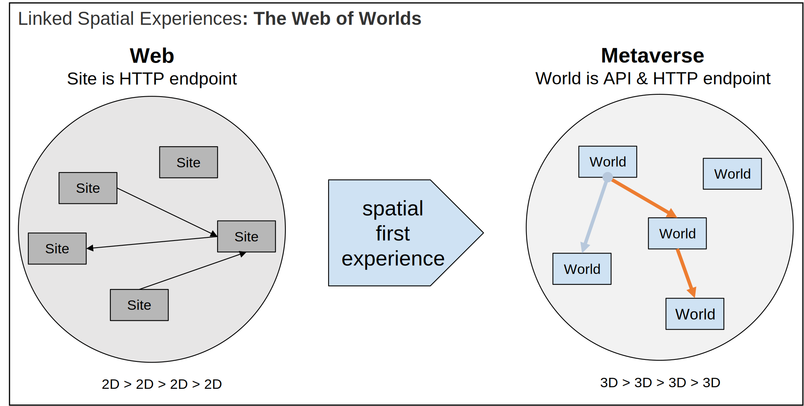
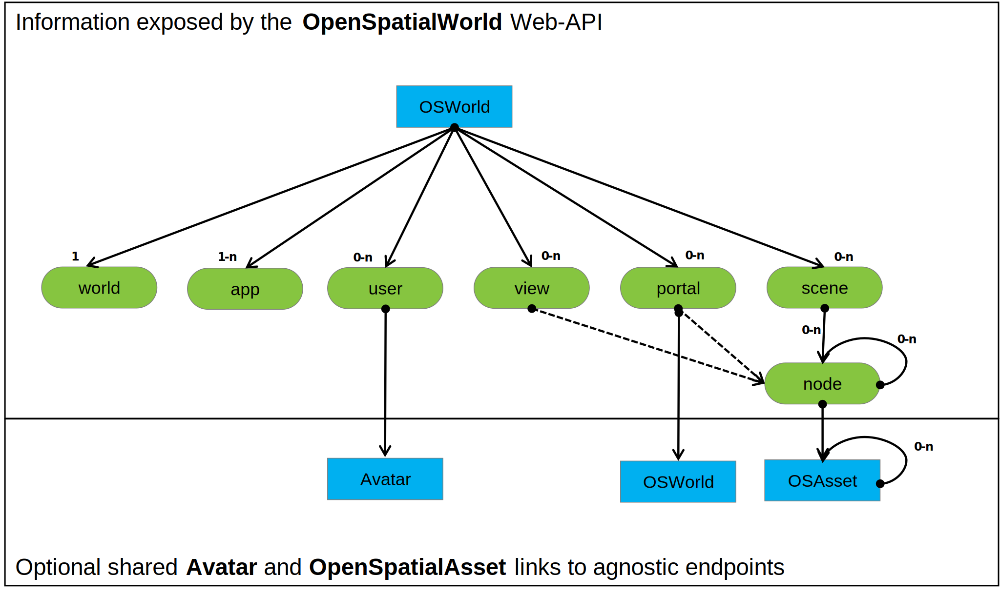
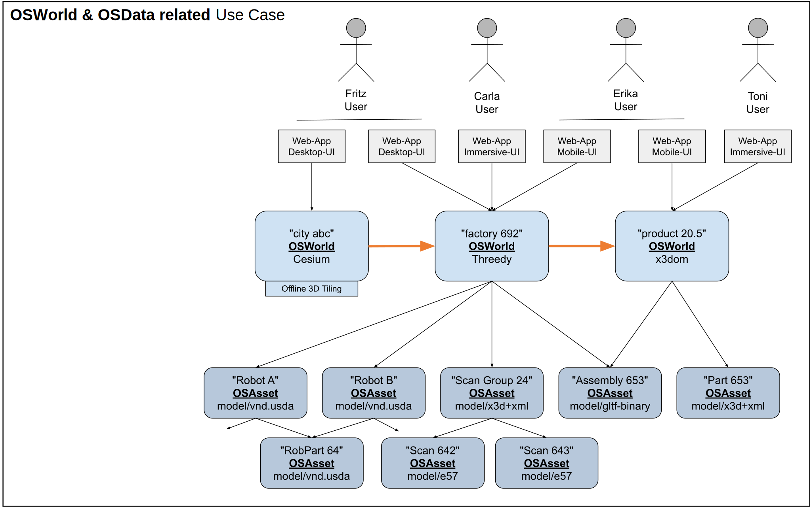

# Hello, Web of Worlds!

Building an open, interconnected and decentralized metaverse using modern web standards and features 🚀

# Foundation

The [Metaverse Standards Forum](https://metaverse-standards.org) plays a central role in coordinating efforts around Metaverse standards, enabling the integration of requirements from SDOs, companies, and end users. The [MSF Core Introduction](https://metaverse-standards.org/#slides) contains the following statement on the first slide, which has not changed in recent years:

> The metaverse combines the **connectivity of the Web** with the **immersiveness** of **spatial computing**

The [3D Web Interoperability WG](https://metaverse-standards.org/domain-groups/3d-web-interoperability/) was established as part of the expanding list of [Active Domain Groups](https://metaverse-standards.org/domain-groups/) to help realize an open metaverse built on the open web platform.

Five coordinated projects were launched, starting with one focused on linking virtual experiences and their data.

> 1. Mechanisms to link and reference virtual worlds and parts thereof

In 2025, a blog post highlighted early outcomes of this project.

## Initial Blog Post 

[Linked Spatial Experiences: The Web of Worlds](https://metaverse-standards.org/news/blog/linked-spatial-experiences-the-web-of-worlds/)

## Ongoing Slide set update

[MSF Project slides](https://docs.google.com/presentation/d/e/2PACX-1vRXc7AF4NbHHJYYgSdOyCqVAfDF-PUA49jOmUXdDucMFBB9WVquD-uIiieC6ISvLSmKNa4j6RCL_RsN/pub?start=true&loop=false&slide=id.g15127d92311_2_114)

## Core Principles of the Web of Worlds

This project to link virtual worlds highlights a compelling analogy between the World Wide Web—a unified system of URL-addressable, interconnected interactive experiences—and what we envision as a cohesive metaverse platform. This envisioned platform comprises numerous addressable and interconnected spatial experiences, or virtual worlds, collectively forming what we call the “Web of Worlds.” Just as websites create a networked digital ecosystem, these spatial-first experiences would interconnect to create a seamless virtual world as shown in Figure 1.

We envision the “Web of Worlds” to be built on the current web infrastructure and support the following core requirements:

### Unified Addressing System
* Each virtual world should have a unique, persistent URI to enable direct linking between worlds
* Persistent data references in linked data environments
* Capability to store URIs/URLs for later access
* Simple URI sharing with additional users

### Universal Experience Accessibility
* The "Web of Worlds" should be accessible through any standard browser
* Emphasis on sharing fully interactive spatial experiences, not just standalone 3D assets
* Web app-controlled user experiences as the dominant delivery model, i.e., use of client data vs. remote rendering

### Rich Spatial Experiences
* Comprehensive user experiences for spatial data of any composition and size
* Support for both static and dynamic spatial data composition
* Scalability to manage billions of spatial data states
* High visual efficiency and fidelity

### Collaborative Environment
* Seamless shared multi-user and multi-device scenarios
* Support for mixed and dynamic user and device configurations e.g., desktop, mobile, and immersive devices
* Cross-world user identity and authentication support (e.g., Single Sign-On)

Linking to a virtual world as an endpoint can provide a unified API to expose standard concepts such as users, views, and spatial content in a unified container. The endpoint API should include functions to join, view, and preview the world in a standard browser/user agent for a given user. Modern web app techniques, including adaptive and responsive frameworks that react to device and network requirements, can be applied to create widely accessible rich user experiences in the browser.

We can see examples of this pattern across the Web today in Single-Page Applications (SPAs) and Web Apps, such as Google Docs, where the user, state, and history are all identified on the URL. So, what information would be essential to represent on a metaverse experience endpoint? Our investigation into use cases will help us enumerate requirements.

## Initial Functional Requirements

We propose the following requirements for the Web of Worlds model:

* Composition of world experiences from multiple assets and endpoints
* Ability to jump to predefined viewpoints in worlds
* Creation and sharing of new viewpoints
* Provision of a preview of the experience before entering
* Consistent experience parameters—such as views, units, and physics—across worlds
* Security measures, e.g., protection against Man in the Middle attacks

## Building a Web API for the Metaverse

To meet these requirements, we propose the following strategy:

* **Build on existing Web and HTTP/HTTPS stack and standards**
  * Provide a single URL endpoint for each addressable world
  * E.g., “http://example.com/superverse/395844”
    
* Allow users to access and join worlds interactively through standard web browsers
  * Automatic user ID controlled join/rejoin management
  * Web-App controlled IO/data/pixel flow
    * e.g., Local data, remote rendering, or smart and balanced 3D streaming
  * Existing users & views should be addressable
    * e.g., “superverse/395844/user/983”

* Optionally allow users to preview worlds without creating additional users
  * User-based authorization required
  * Web-App controlled IO/data/pixel flow
  * Existing users/views should be addressable

* Optionally expose scene state as model data
  * Including external links, using multiple asset standards, e.g., X3D, USD, glTF

# API Proposals

## Open Spatial World API

[OpenSpatialWorld API](specification/OpenSpatialWorld)

## Open Spatial Asset API

[OpenSpatialAsset API](specification/OpenSpatialAsset)

# Implementations

## Open Spatial World API

| Name | License | Level | Spatial Asset Formats |  
| --- | --- | --- | --- | 
| x3domWorld | Free | 5  | gltf-binary, gltf+json, x3d+xml |
| [threedy.io](https://www.threedy.io) | Commercial | 5 | e57, gltf-binary, gltf+json, JT, step, step+xml, step+zip, step-xml+zip, step-xml+zip, vnd.usda, vnd.usdz+zip, x3d-vrml, x3d+fastinfoset, x3d+xml, las |
| HTMLModeWrapper | Free | 3  | vnd.usdz+zip |
| CesiumWrapper | Free | 2 |
| UnrealWrapper | Free | 2 |
| UnityWrapper | Free | 2 |

## Open Spatial Asset API

| Name | License | Format | 
| --- | --- | --- |
| [RapidPipeline](https://rapidpipeline.com) | Commercial | gltf-binary, gltf+json, vnd.usda, vnd.usdz+zip, x3d+xml |
| [Sketchfab](https://sketchfab.com) | Commercial | gltf-binary, gltf+json, vnd.usda, vnd.usdz+zip |

# Live Demo Worlds

| Name | Endpoint | API Level |
| --- | --- | --- |
| hello world | [testWorld.WebOfWorlds.io](https://testWorld.OpenSpatialWorld.io) | 3 | 
| open portal | [openPortal.WebOfWorlds.io](https://testWorld.OpenSpatialWorld.io) | 5 | 
| threedy industrial Metaverse Use-Case | [threedy.space/msf/60394sdf6](http://threedy.space/ms/60394sdf6) | 5 | 

# MSF Use Cases

## 

# Standardization
