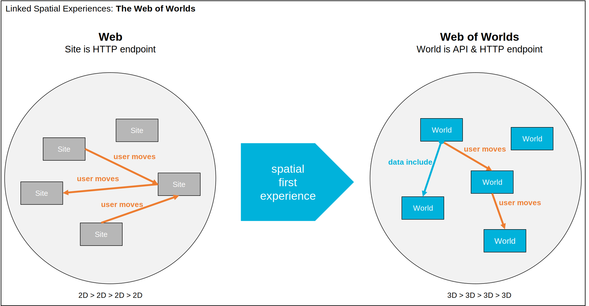
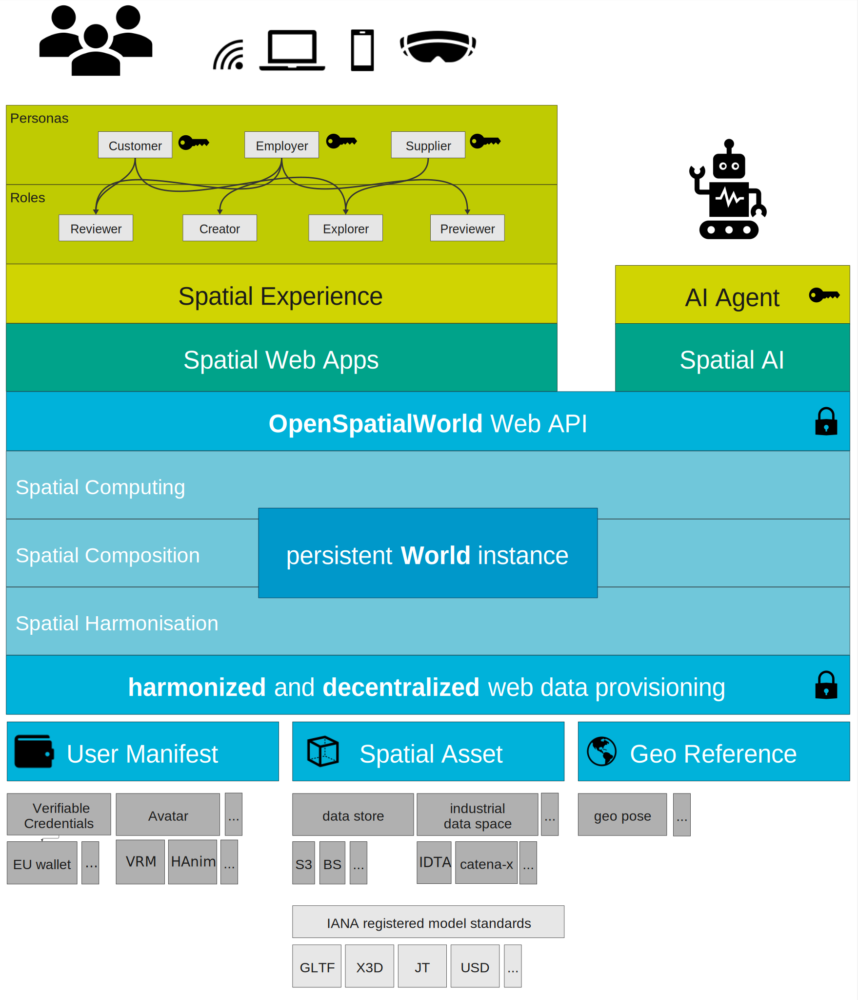
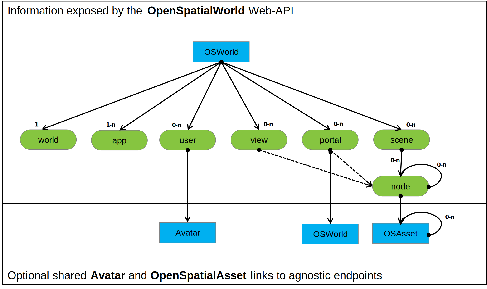
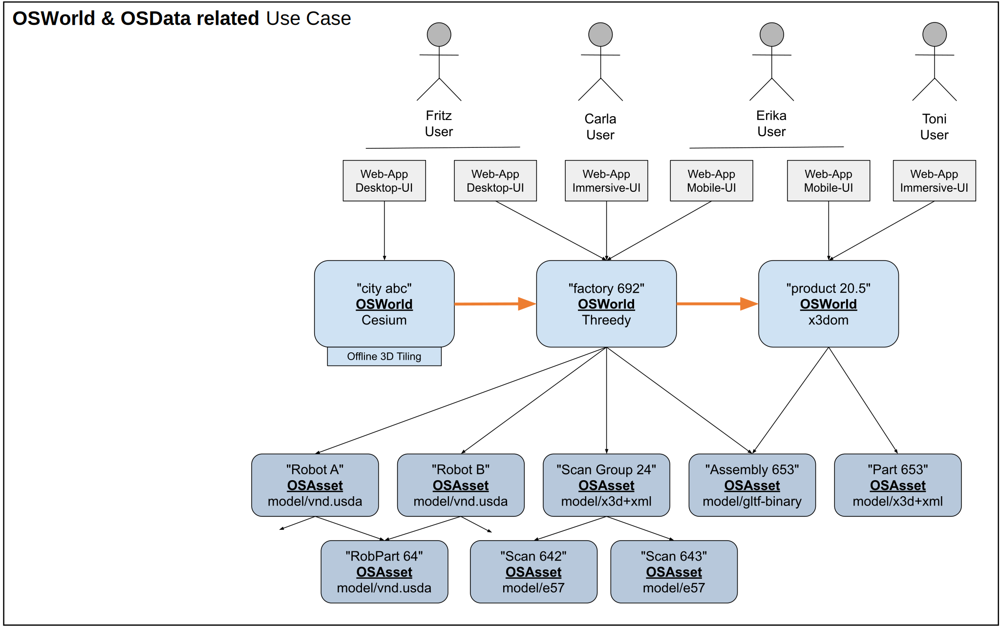

# Hello, Web of Worlds!

Enabling an open, decentralized and efficient Metaverse on the Open Web Platform 🚀

# Foundation

The [Metaverse Standards Forum](https://metaverse-standards.org) plays a central role in coordinating efforts around Metaverse standards, enabling the integration of requirements from SDOs, companies, and end users. The [MSF Core Introduction](https://metaverse-standards.org/#slides) contains the following statement on the first slide, which has not changed in recent years:

> The metaverse combines the **connectivity of the Web** with the **immersiveness** of **spatial computing**

The [3D Web Interoperability WG](https://metaverse-standards.org/domain-groups/3d-web-interoperability/) was established as part of the expanding list of [Active Domain Groups](https://metaverse-standards.org/domain-groups/) to help realize an open metaverse built on the open web platform.

Five coordinated projects were launched, starting with one focused on linking virtual experiences and their data.

> 1. Mechanisms to link and reference virtual worlds and parts thereof

In 2025, a blog post highlighted early outcomes of this project. 

## Initial Blog Post 

[Linked Spatial Experiences: The Web of Worlds](https://metaverse-standards.org/news/blog/linked-spatial-experiences-the-web-of-worlds/)

## Ongoing Slide set update

[MSF Project slides](https://docs.google.com/presentation/d/e/2PACX-1vRXc7AF4NbHHJYYgSdOyCqVAfDF-PUA49jOmUXdDucMFBB9WVquD-uIiieC6ISvLSmKNa4j6RCL_RsN/pub?start=true&loop=false&slide=id.g15127d92311_2_114)

## MSF White Paper, 2026-03-31  

[The Web of Worlds (WoW) Whitepaper](https://webofworlds.github.io/initial_MSF_Whitepaper)

## Core Principles from the white paper 

We envision a novel and open architecture that builds upon OWP principles and standards, yet provides new, simplified, and direct solutions for virtual world consumers and producers.

### The Spatial Worlds
The world is not a single data state or document, but several persistent aspects that are linked with each other and can be accessed via the same API endpoint.

* Web-applications to deliver a spatial experience on a new or known physical device 
* Users to handle active and passive aspects 
* Views to expose a viewing pose or camera to the consumer  
* Portals stores links to external and independent world instance  
* Spatial Composition Graph hieratical structure to manage any number of spatial assets links

### The User Manifest
Users must be able to move between virtual worlds, carrying with them their digital identity, with full control over how their data is used, when it is used, and how much of it is shared. 

It is envisioned to use existing technology and standards that will provide the security (including anonymity), interoperability and transportability required for a User to carry and use their data safely with Virtual Worlds.

* User Digital Wallet
* User Manifest
* Decentralized Storage
 
 ### The Spatial Asset

Our objective is not to introduce or create a new data format, but rather to leverage existing **standards as spatial assets within the virtual world**. The RFC2077 standard and its associated model content registrations have formed a robust foundation on the existing web for many years. We anticipate that the USD-, GLTF-, and X3D-families of formats, which are already registered, will play a crucial role in various use cases. What is significant here is that we not only transfer and provide data using HTTP/S, but we also aim to utilize generic and harmonized DID resolvers to facilitate Asset links within wallets and related structures  

# Proposed architecture 

## Open Spatial World API

[OpenSpatialWorld API](specification/OpenSpatialWorld)

## Open User Manifest API

[OpenUserManifest API](specification/OpenUserManifest)

# Implementations

## Open Spatial Asset API

[OpenSpatialAsset API](specification/OpenSpatialAsset)

# Implementations

## Open Spatial World API

| Name | License | Level | Spatial Asset Formats |  
| --- | --- | --- | --- | 
| simpleWorld | Free | 5  | gltf-binary, gltf+json, x3d+xml |
| [threedy.io](https://www.threedy.io) | Commercial | 5 | e57, gltf-binary, gltf+json, JT, step, step+xml, step+zip, step-xml+zip, step-xml+zip, vnd.usda, vnd.usdz+zip, x3d-vrml, x3d+fastinfoset, x3d+xml, las |
| HTMLModeWrapper | Free | 3  | vnd.usdz+zip |
| CesiumWrapper | Free | 2 |
| UnrealWrapper | Free | 2 |
| UnityWrapper | Free | 2 |

## Open Spatial Asset API

| Name | License | Spatial Asset Formats | 
| --- | --- | --- |
| [RapidPipeline](https://rapidpipeline.com) | Commercial | gltf-binary, gltf+json, vnd.usda, vnd.usdz+zip, x3d+xml |
| [Sketchfab](https://sketchfab.com) | Commercial | gltf-binary, gltf+json, vnd.usda, vnd.usdz+zip |

# Live Demo Worlds

| Name | Endpoint | API Level |
| --- | --- | --- |
| hello world | [testWorld.WebOfWorlds.io](https://testWorld.OpenSpatialWorld.io) | 3 | 
| open portal | [openPortal.WebOfWorlds.io](https://testWorld.OpenSpatialWorld.io) | 5 | 
| threedy industrial Metaverse Use-Case | [threedy.space/msf/60394sdf6](http://threedy.space/ms/60394sdf6) | 5 | 

# MSF Use Cases

## 

# Standardization
